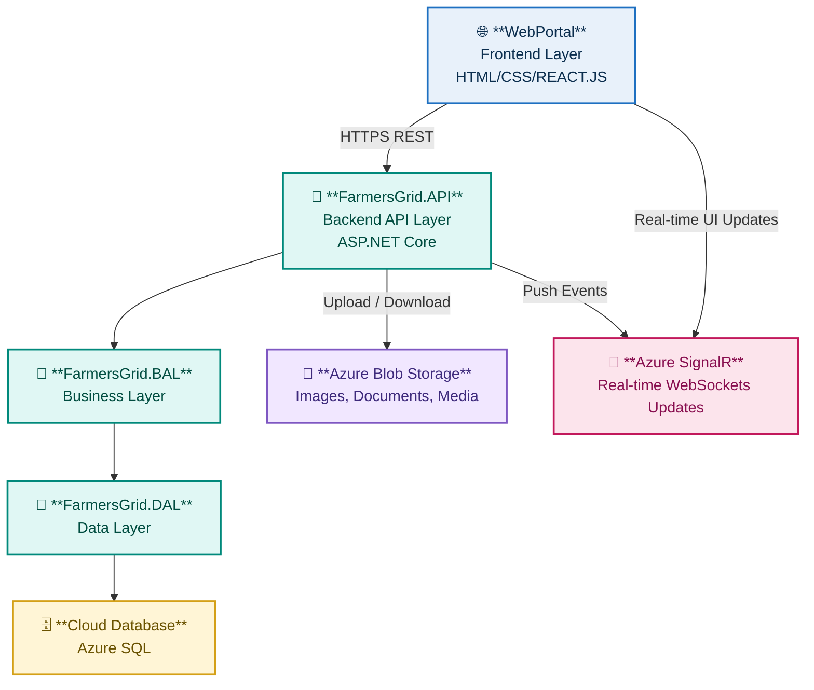

# **Farmers-Grid**

The project **Farmers-Grid** aims to solve the middleman problem faced by farmers, which reduces their income.
This system removes intermediaries through **mobile & web applications**, enabling farmers to connect directly with consumers and retailers.

---
 **Features**

- Direct farmer–buyer communication  
- Real-time chat with SignalR  
- Smart matchmaking algorithm  
- Product listing & request management  
- Integrated logistics planning  
- Web + mobile support  
- Secure authentication (JWT + Cookies)
  
## **INTERFACE OVERVIEW**

<div align="center">

  
<br/>
  
<br/>


</div>

---

## **TECH STACK & ARCHITECTURE**

<table>
<tr>
<td width="260" valign="top">

### **Tech Stack**

<table>
  <!-- WEB PORTAL -->
  <tr>
    <td align="center">
      <b style="font-size:16px;">WEB PORTAL</b><br/><br/>
      <code style="font-size:15px;">React.js • HTML • CSS</code><br/><br/>
      <strong>Auth • State Manager • SignalR Client</strong>
    </td>
  </tr>

  <tr><td align="center"><strong>↓ HTTPS REST API</strong></td></tr>

  <!-- API -->
  <tr>
    <td align="center">
      <b style="font-size:16px;">FARMERSGRID.API</b><br/><br/>
      <code style="font-size:15px;">ASP.NET Core Web API</code><br/><br/>
      <strong>JWT + Cookie Auth</strong><br/>
      <strong>Controllers • SignalR Hubs</strong>
    </td>
  </tr>

  <tr><td align="center"><strong>↓</strong></td></tr>

  <!-- BAL -->
  <tr>
    <td align="center">
      <b style="font-size:16px;">BUSINESS LOGIC (BAL)</b><br/><br/>
      <code style="font-size:15px;">C# Libraries</code><br/><br/>
      <strong>Matching • Routing • Domain Logic</strong>
    </td>
  </tr>

  <tr><td align="center"><strong>↓</strong></td></tr>

  <!-- DAL -->
  <tr>
    <td align="center">
      <b style="font-size:16px;">DATA ACCESS (DAL)</b><br/><br/>
      <code style="font-size:15px;">C# Data Layer</code><br/><br/>
      <strong>Repositories • SQL Operations</strong>
    </td>
  </tr>

  <tr><td align="center"><strong>↓</strong></td></tr>

  <!-- CLOUD STORAGE -->
  <tr>
    <td align="center">
      <b style="font-size:16px;">CLOUD DATABASE</b><br/><br/>
      <code style="font-size:15px;">Azure SQL</code><br/>
      <code style="font-size:15px;">Azure Blob Storage</code><br/><br/>
      <strong>Persistent Data • Image/Media Storage</strong>
    </td>
  </tr>
</table>

</td>

<td width="1000" valign="center" align="center">

### **Visual Flow**



</td>
</tr>
</table>

---

## System Modules

<table>
  <!-- FARMER MODULE -->
  <tr>
    <td colspan="2"><strong>FARMER MODULE</strong></td>
  </tr>
  <tr>
    <td width="40%">
      Handles all farmer-facing features related to product management and negotiation.<br><br>
      • Create & manage product listings<br>
      • Set pricing<br>
      • Receive buyer proposals<br>
      • Accept/decline offers<br>
      • Chat with buyers<br>
      • Choose logistics options
    </td>
    <td width="60%">
      
    </td>
  </tr>

  <!-- BUYER MODULE -->
  <tr>
    <td colspan="2"><strong>BUYER MODULE</strong></td>
  </tr>
  <tr>
    <td width="40%">
      Tools for buyers to find products, negotiate, and contact farmers.<br><br>
      • Create product requests<br>
      • Set desired price<br>
      • View matched farmers<br>
      • Send proposals<br>
      • Chat with farmers<br>
      • Delivery/pickup options
    </td>
    <td width="60%">
      
    </td>
  </tr>

  <!-- MATCHMAKER MODULE -->
  <tr>
    <td colspan="2"><strong>MATCHMAKER MODULE</strong></td>
  </tr>
  <tr>
    <td width="40%">
      Computes compatibility between farmers and buyers using scoring logic.<br><br>
      • Compare price expectations<br>
      • Distance calculation<br>
      • Match demand & quantity<br>
      • Generate match score<br>
      • Rank best matches
    </td>
    <td width="60%">
      
    </td>
  </tr>

  <!-- MESSAGING MODULE -->
  <tr>
    <td colspan="2"><strong>MESSAGING MODULE</strong></td>
  </tr>
  <tr>
    <td width="40%">
      Real-time in-app communication.<br><br>
      • WebSocket chat<br>
      • Optional phone reveal<br>
      • Message history
    </td>
    <td width="60%">
      
    </td>
  </tr>

  <!-- LOGISTICS MODULE -->
  <tr>
    <td colspan="2"><strong>LOGISTICS MODULE</strong></td>
  </tr>
  <tr>
    <td width="40%">
      Plans transportation efficiently.<br><br>
      • Pooled transport<br>
      • Multi-drop optimization<br>
      • Shared route costs<br>
      • Self-transport support
    </td>
    <td width="60%">
      
    </td>
  </tr>
</table>


---

## **Installation**

### **1. Clone the Repository**

```bash
git clone https://github.com/Kathirvelan213/farmers-grid.git
cd farmers-grid
```

### **2. Backend Setup (ASP.NET Core API)**

* Open **farmers-grid.sln** in Visual Studio
* Run the SQL scripts inside the **sqlCommands/** folder
* Update the DB connection string in **appsettings.json**
* Restore NuGet packages
* Run the **FarmersGrid.API** project

### **3. Run the Web Portal**

```bash
cd web-portal
npm install
npm start
```

---

