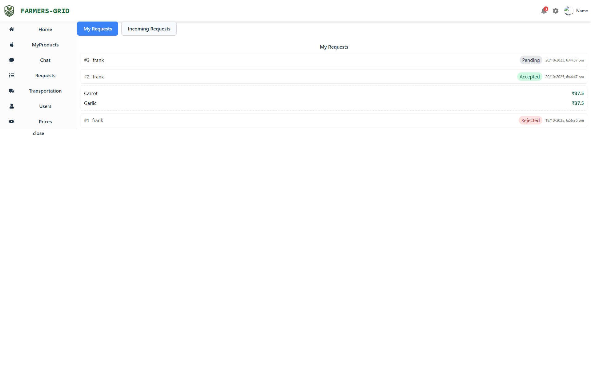

# farmers-grid
The project 'farmers-grid' aims to solve the middleman problem faced by farmers leading to a lower income for them. This project eliminates the middleman with the use of a Mobile &amp; web application to connect farmers directly to the consumers/retailers 

## System Modules
| Module | Description |
|---------------|--------------------------------------------|
| | |
| Farmer Module | |
| Handles all farmer-facing features related to product management and negotiation.  - Create and manage product listings - Set and update pricing - Receive buyer proposals - Accept or decline offers - Chat with buyers - Choose transport or logistics options |  |
| Buyer Module |  |
| Provides buyers with tools to find products, negotiate, and contact farmers.  - Create product requests - Set desired prices - Receive matched farmers - Send purchase proposals - Chat with farmers - Select delivery or pickup options | |
| Matchmaker Module |  |
| Computes compatibility between farmers and buyers using data-driven scoring.  - Compare price expectations - Calculate distance - Match demand and available quantity - Generate a match score - Rank best potential matches | |
| Messaging Module | |
| Allows direct communication between users.  - In-app real-time chat - Option to reveal phone number - Basic message history |  |
| Logistics Module |  |
| Coordinates the transportation of goods efficiently.  - Pooled transport routing - Optimized multi-drop delivery - Cost-efficient shared routes - Support for self-arranged transport | |
