# Farmers-Grid
The project 'farmers-grid' aims to solve the middleman problem faced by farmers leading to a lower income for them. This project eliminates the middleman with the use of a Mobile &amp; web application to connect farmers directly to the consumers/retailers 

**SNEAK-PEAK**

  
 
 
 
 
 

## 🏗️ System Architecture

<table>
<tr>
<td width="300" valign="top">

### Tech Stack

<table>
<tr>
<td align="center">
<b> WebPortal</b> 
Frontend Layer  
<code>HTML/CSS/React.js</code> 
Auth • Dashboard • SasManager
   
API Consumer • SignalRService
</td>
</tr>
<tr><td align="center">↓ HTTPS REST API</td></tr>
<tr>
<td align="center">
<b> FarmersGrid.API</b> 
Backend API Layer  
<code>ASP.NET Core Web API</code> 
<code>HTTP Cookie +JWT Auth</code> 
Controllers → Services → DTOs
   
Hubs (Azure SignalR Websockets)->Services
</td>
</tr>
<tr><td align="center">↓</td></tr>
<tr>
<td align="center">
<b> FarmersGrid.BAL</b> 
Business Layer  
<code>C# Class Library</code> 
AuthBusiness • UserBusiness 
ProductBusiness • MatchScoreManager 
ChatManager • TransportBusiness
</td>
</tr>
<tr><td align="center">↓</td></tr>
<tr>
<td align="center">
<b> FarmersGrid.DAL</b> 
Data Layer  
<code>DbContext</code> 
UserRepo • Products • Schedules 
  ChatData • RequestsData
</td>
</tr>
<tr><td align="center">↓</td></tr>
<tr>
<td align="center">
<b> Cloud Database</b> 
Azure SQL • Azure Blob Storage
</td>
</tr>
</table>

</td>
<td width="1000" valign="center" align="center">

### Visual Flow

```mermaid
flowchart TD
    A[🌐 **WebPortal**<br/>Frontend Layer<br/>HTML/CSS/REACT.JS]
    B[🔌 **FarmersGrid.API**<br/>Backend API Layer<br/>ASP.NET Core]
    C[💼 **FarmersGrid.BAL**<br/>Business Layer]
    D[💾 **FarmersGrid.DAL**<br/>Data Layer]
    E[🗄️ **Cloud Database**<br/>Azure SQL]
    G[📁 **Azure Blob Storage**<br/>Images, Documents, Media]
    H[🔔 **Azure SignalR**<br/>Real-time WebSockets Updates]

    %% Primary Flow
    A -->|HTTPS REST| B
    B --> C
    C --> D
    D --> E


    %% Additional Cloud Integrations
    A -->|Real-time UI Updates| H
    B -->|Push Events| H
    B -->|Upload / Download| G


    %% Styles 
    style A fill:#E8F1FA,stroke:#1E70C1,stroke-width:2px,color:#0B2E4E
    style B fill:#E0F7F4,stroke:#00897B,stroke-width:2px,color:#004D40
    style C fill:#E0F7F4,stroke:#00897B,stroke-width:2px,color:#004D40
    style D fill:#E0F7F4,stroke:#00897B,stroke-width:2px,color:#004D40
    style E fill:#FFF5D6,stroke:#D4A017,stroke-width:2px,color:#6A5200
    style G fill:#F1E7FF,stroke:#7E57C2,stroke-width:2px,color:#3E2A7C
    style H fill:#FCE4EC,stroke:#C2185B,stroke-width:2px,color:#880E4F

```

</td>
</tr>
</table>

## System Modules
| Module | Description |
|---------------|--------------------------------------------|
| | |
| Farmer Module | |
| Handles all farmer-facing features related to product management and negotiation.  - Create and manage product listings - Set and update pricing - Receive buyer proposals - Accept or decline offers - Chat with buyers - Choose transport or logistics options |  |
| Buyer Module |  |
| Provides buyers with tools to find products, negotiate, and contact farmers.  - Create product requests - Set desired prices - Receive matched farmers - Send purchase proposals - Chat with farmers - Select delivery or pickup options | |
| Matchmaker Module |  |
| Computes compatibility between farmers and buyers using data-driven scoring.  - Compare price expectations - Calculate distance - Match demand and available quantity - Generate a match score - Rank best potential matches | |
| Messaging Module | |
| Allows direct communication between users.  - In-app real-time chat - Option to reveal phone number - Basic message history |  |
| Logistics Module |  |
| Coordinates the transportation of goods efficiently.  - Pooled transport routing - Optimized multi-drop delivery - Cost-efficient shared routes - Support for self-arranged transport | |

